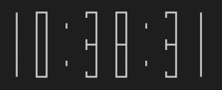

# simple-rust-clock

This project is a tiny example of how to do fun things in Rust.
This example avoids using graphics to simplify the learning process.

The digits are formed using Unicode graphics characters which
can use colours and a wide variety of shapes.

[Link to Youtube](https://www.youtube.com/watch?v=gX6EFBICIcY "Youtube video")
